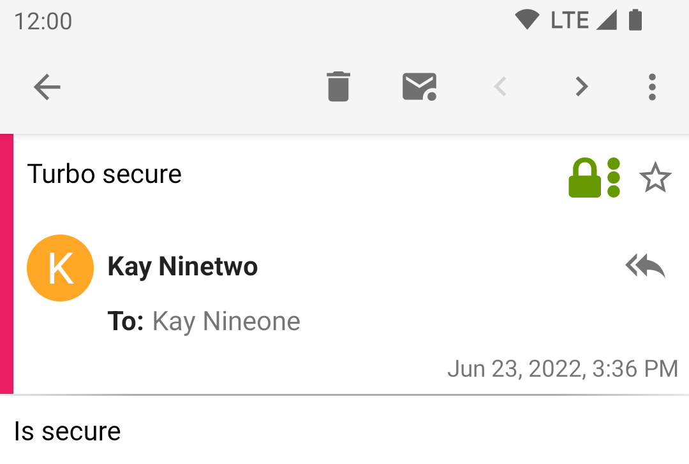
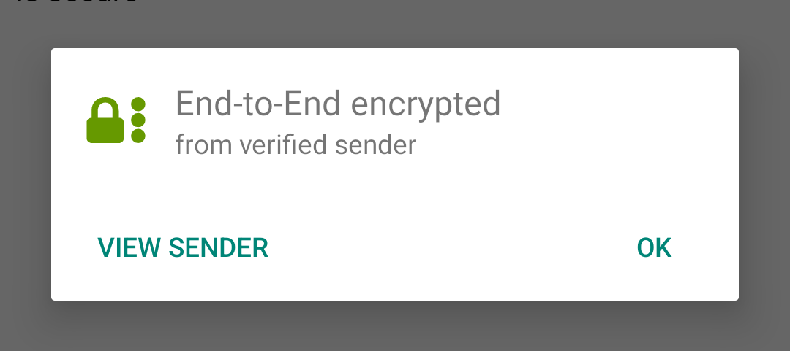
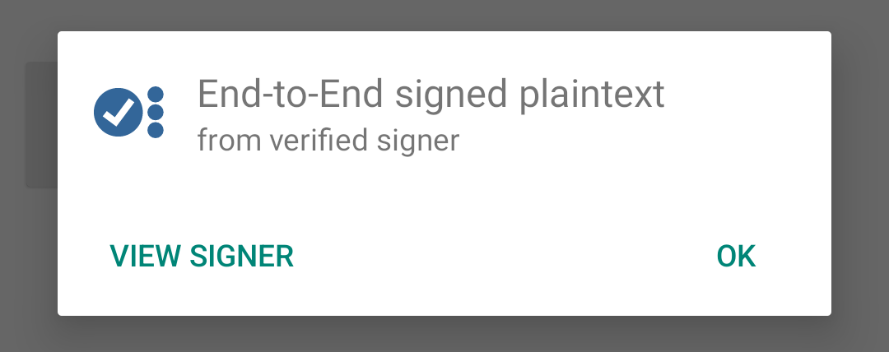

# PGP End-to-end encryption

K-9 Mail does not have built-in encryption capabilities. Instead, it uses an external Android application called
[OpenKeychain](https://www.openkeychain.org/).

## OpenKeychain Usage

### Selecting OpenKeychain as a Crypto Provider

To start using PGP you first need to link OpenKeychain with K-9. To do this:

* Install OpenKeychain from wherever you get your apps
* In K-9, Select Settings -> Accounts
* Choose the account for encryption
* Select End-to-end encryption
* Enable OpenPGP support

## Selecting a Key

Now you'll need to select a key. Click the 'Configure end-to-end key' option.

You'll be sent a screen in the OpenKeychain app:

Select either a key you've already imported/created or create a new key:

See the [OpenKeychain](https://www.openkeychain.org/) website for more information on creating and managing keys.

### Signing & Encrypting Mail

When composing e-mail with OpenKeychain setup and installed a new pad-lock icon
appears in the top left of the composition screen. The icon represents the type of signing
and encryption that will be applied to the message.

Signing is the process of authenticating who wrote an email. Encrypting is the process of ensuring nobody but the
intended recipient can read it. Signing and encryption both guarantee the email hasn't been tampered with.

Tapping the icon leads to dialog that allows you to change between one of four states:

* Never Sign or Encrypt - This means no encryption or signing will be applied
* Always Sign, Never Encrypt - This means the email will be signed, but won't be encrypted.
* Always Sign, Encrypt if Possible - The means the email will be signed, but if it can't be encrypted it will be sent
  anyway.
* Always Sign, Always Encrypt - This means the email will only be sent if it can be both signed and encrypted.

### Decrypting & Verifying Signed Mail

When viewing encrypted mail, once configured, K-9 will automatically use OpenKeychain to try to decrypt it with your
key and check the signature.

For encrypted and trusted signed messages it will look like this.

Tapping on the green lock icon brings up this modal:

For trusted signed messages it will look like this.

And tapping on the icon brings up this:

Tapping on the 'View Signer' option will open the contact in OpenKeychain.

